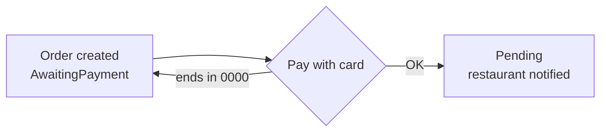
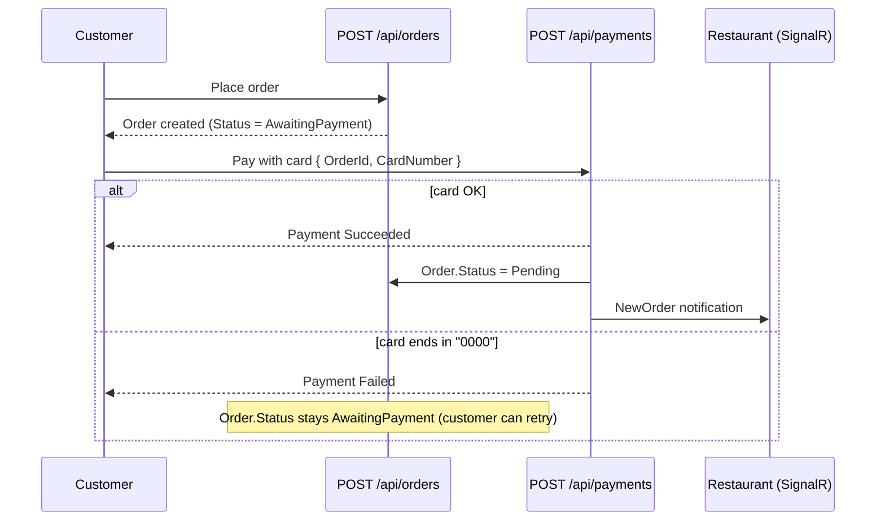

# CaptainCrave Backend

ASP.NET Core 10 Web API for the CaptainCrave food ordering platform.

---

## Table of Contents

- [CaptainCrave Backend](#captaincrave-backend)
  - [Table of Contents](#table-of-contents)
  - [Architecture](#architecture)
    - [Domain model](#domain-model)
    - [Orchestration (.NET Aspire)](#orchestration-net-aspire)
  - [Code Patterns](#code-patterns)
    - [Dependency injection](#dependency-injection)
    - [DTOs at the boundary](#dtos-at-the-boundary)
    - [Repository pattern](#repository-pattern)
    - [Input validation](#input-validation)
    - [Role-based authorization](#role-based-authorization)
    - [Error handling](#error-handling)
    - [Fluent API configuration](#fluent-api-configuration)
  - [Soft delete and audit fields](#soft-delete-and-audit-fields)
  - [Real-time notifications (SignalR)](#real-time-notifications-signalr)
  - [Mock payment system](#mock-payment-system)
  - [API Endpoints](#api-endpoints)
    - [Auth (public)](#auth-public)
    - [Users](#users)
    - [Restaurants](#restaurants)
    - [Menus](#menus)
    - [Categories](#categories)
    - [Menu Items](#menu-items)
    - [Orders](#orders)
    - [Payments](#payments)
    - [Reviews](#reviews)
    - [Image uploads](#image-uploads)
  - [Technology](#technology)
  - [Authentication](#authentication)
  - [Secrets](#secrets)
  - [Database](#database)
  - [Seed data](#seed-data)
  - [Running the Project](#running-the-project)
  - [Tests](#tests)

---

## Architecture

The backend uses a layered architecture. Each layer has one job, and each layer only talks to the layer directly below it.

A request flows down through the layers, and the result flows back up through the same layers:

```
Request:   Controller -> Service -> Repository -> Database
Response:  Controller <- Service <- Repository <- Database
```

For example, when a controller needs data, it asks a service. The service asks a repository. The repository queries the database. The result then travels back up: the repository returns it to the service, and the service returns it to the controller. So the call goes down, and the data comes back up, through the same chain. A controller never queries the database directly, and a service never deals with HTTP objects.

Layers only depend on the layer below them through interfaces (for example, a service depends on `IRestaurantRepository`, not on `RestaurantRepository` directly). This keeps layers loosely coupled and easy to test, because a real repository can be swapped for a fake one in tests.

| Layer | Folder | Responsibility |
|---|---|---|
| Controllers | `Controllers/` | Receive HTTP requests, validate input, return responses |
| Services | `Services/` | Business logic (ownership checks, status transitions, sending notifications) |
| Repositories | `Repositories/` | Database queries via EF Core |
| Models | `Models/` | EF Core entities mapped to database tables |
| DTOs | `DTOs/` | Data shapes used at the API boundary (never expose entities directly) |
| Mappers | `Mappers/` | Convert between models and DTOs |
| Configurations | `Data/Configurations/` | Fluent API table and column setup per entity |
| Hubs | `Hubs/` | SignalR hub for real-time communication with clients |
| Data | `Data/` | `AppDbContext`, EF Core configurations, `DbSeeder` |

**Rules:** controllers never touch the database directly, services never know about HTTP, repositories never contain business rules.

### Domain model

```
Restaurant --< Menu --< Category
                  \--< MenuItem >-- Category (optional)
```

A `Restaurant` can have multiple `Menu`s. Each `Menu` has its own `Category` list (for example "Burgere", "Tilbehør", "Drikkevarer") and its own `MenuItem`s. A `MenuItem` belongs to exactly one `Menu`, and its `CategoryId` is optional, so items can be listed without a category (for example a combo or daily deal). The `Menu` layer exists so a restaurant can have more than one menu card (for example seasonal, or breakfast and lunch) without duplicating categories or items.

Orders (`Order` and `OrderItem`) store a reference to the customer, the restaurant, and a snapshot of the ordered menu items with their quantity and price at order time.

A `Review` belongs to a `User` and a `Restaurant`, with a `Rating` from 1-5. A user may leave at most one review per restaurant (enforced by a unique index on `user_id`+`restaurant_id`), and only after a `Delivered` order from that restaurant (see [Reviews](#reviews)).

### Orchestration (.NET Aspire)

The API is also wired up under `CaptainCrave.AppHost`, a .NET Aspire app host that starts the API together with the Angular client with a single command (`aspire run` from `Backend/CaptainCrave.AppHost`), and shows both in one dashboard for local development.

---

## Code Patterns

### Dependency injection
All services and repositories are registered as `Scoped` in `Program.cs` and injected via primary constructors:

```csharp
public class RestaurantService(IRestaurantRepository repo) : IRestaurantService
```

### DTOs at the boundary
Entities are never returned directly from controllers. Every response is mapped to a DTO via a static extension method:

```csharp
public static RestaurantDto ToDto(this Restaurant r) => new() { Id = r.Id, Name = r.Name, ... };
```

### Repository pattern
All database access goes through a typed interface. No `AppDbContext` in controllers or services:

```csharp
public interface IRestaurantRepository
{
    Task<IEnumerable<Restaurant>> GetAllAsync();
    Task<Restaurant?> GetByIdAsync(int id);
    Task<Restaurant> CreateAsync(Restaurant restaurant);
}
```

### Input validation
Simple rules use data annotations. Cross-field rules (for example, a delivery address is required when the delivery type is `Delivery`) use `IValidatableObject`:

```csharp
public IEnumerable<ValidationResult> Validate(ValidationContext ctx)
{
    if (DeliveryType == DeliveryType.Delivery && string.IsNullOrWhiteSpace(DeliveryAddress))
        yield return new ValidationResult("Delivery address is required.", [nameof(DeliveryAddress)]);
}
```

### Role-based authorization
Endpoints are protected with `[Authorize(Roles = "...")]`. The role is embedded in the JWT at login as a claim (`UserRole`: `Customer`, `Restaurant`, `Admin`). Public read endpoints have no attribute:

```csharp
[HttpPost]
[Authorize(Roles = "Restaurant,Admin")]
public async Task<IActionResult> Create(CreateRestaurantDto dto) { ... }
```

Ownership is enforced in the service layer on top of the role check. A `Restaurant` user can only manage menus, categories, menu items, and orders that belong to their own restaurant. `Admin` bypasses this check.

### Error handling
Services throw typed exceptions. Controllers catch them and map to HTTP status codes:

```csharp
catch (KeyNotFoundException ex)          { return BadRequest(new { message = ex.Message }); }
catch (UnauthorizedAccessException ex)   { return StatusCode(403, new { message = ex.Message }); }
catch (InvalidOperationException ex)     { return Conflict(new { message = ex.Message }); } // or BadRequest, depending on the case
```

Permanent (hard) delete endpoints also catch `DbUpdateException`, so trying to permanently delete something that other data still depends on (for example a menu item that appears on a past order) returns a clean 409 Conflict instead of a raw database error.

### Fluent API configuration
Each entity has its own `IEntityTypeConfiguration<T>` in `Data/Configurations/` (`RestaurantConfiguration`, `MenuConfiguration`, `CategoryConfiguration`, `MenuItemConfiguration`, `OrderConfiguration`, `OrderItemConfiguration`, `UserConfiguration`), keeping `AppDbContext.OnModelCreating` clean. Tables and columns use snake_case naming.

---

## Soft delete and audit fields

`Restaurant`, `Menu`, `Category`, and `MenuItem` all support soft delete: deleting one of these just hides it, it does not remove the row. This means a restaurant owner (or an admin) can undo a delete instead of losing data by mistake.

- **`ISoftDeletable`** (`Models/ISoftDeletable.cs`): adds `IsDeleted` and `DeletedAt` to an entity.
- **`IAuditable`** (`Models/IAuditable.cs`): adds `CreatedAt` and `UpdatedAt`. This is implemented by every entity (`User`, `Restaurant`, `Menu`, `Category`, `MenuItem`, `OrderItem`, and `Order`, which already tracked both fields on its own).
- **`SoftDeleteHelper`** (`Repositories/SoftDeleteHelper.cs`): a small shared helper (`MarkDeleted`/`MarkRestored`) so every repository sets the same fields the same way, instead of repeating the same three lines per entity.
- **`EntityConfigurationExtensions`** (`Data/Configurations/EntityConfigurationExtensions.cs`): shared Fluent API setup (`ConfigureAudit()`, `ConfigureSoftDelete()`) so every entity configuration sets up its columns the same way.

A soft-deleted row is hidden automatically from every normal query with an EF Core global query filter, and the filter also cascades down the hierarchy: soft-deleting a `Restaurant` also hides its `Menu`s, `Category`s, and `MenuItem`s, without needing to touch every row by hand. Deleting a `Menu` also marks its own `MenuItem`s as deleted, so a "restaurant's deleted items" list stays meaningful even if the whole menu was removed.

Each of the four entities has the same four operations, following the same route pattern:

| Action | Route | What it does |
|---|---|---|
| Soft delete | `DELETE /{id}` | Hides the row. Can be undone. |
| Restore | `POST /{id}/restore` | Un-hides a previously soft-deleted row. |
| Hard delete | `DELETE /{id}/permanent` | Permanently removes the row. Cannot be undone. |
| List trash | `GET .../deleted` | Lists the soft-deleted rows, so they can be reviewed before restoring. |

Order history is not affected by any of this: `OrderRepository` deliberately ignores the menu item and restaurant filters when loading orders, so a past order still shows the correct item name and restaurant even if that item or restaurant is later soft-deleted.

---

## Real-time notifications (SignalR)

Instead of clients polling for order updates, the API pushes live events over a SignalR hub:

- **Hub endpoint:** `/hubs/notifications`. Requires the same JWT used for the REST API.
- **`NewOrder`**: sent to a restaurant when it receives a new order.
- **`OrderStatusChanged`**: sent to a customer when their order's status changes.

When a client connects (`NotificationHub.OnConnectedAsync`), it is placed into a personal group (`user-{id}`). If the user is a restaurant owner, it is also placed into their restaurant's group (`restaurant-{id}`). See `Hubs/NotificationHub.cs` and `Hubs/NotificationGroup.cs`. Events are raised through `INotificationService` and `SignalRNotificationService`, and are called from `OrderService` whenever an order is created (`CreateAsync`) or its status changes (`UpdateStatusAsync`).

Browsers cannot attach an `Authorization` header to a SignalR/WebSocket connection. So the JWT is instead passed as a query string (`?access_token=...`). `Program.cs` reads this in a custom `JwtBearerEvents.OnMessageReceived` handler, scoped to paths starting with `/hubs`. CORS for the hub uses one specific origin (`http://localhost:4200`) with `.AllowCredentials()`, because SignalR requires credentialed requests, not a wildcard origin.

---

## Mock payment system

No real payment provider is integrated. `PaymentService` fakes a card charge: cards ending in `"0000"` decline, everything else succeeds with a generated `ProviderReference`.





1. `POST /api/orders` creates the order as `Status = AwaitingPayment`. The restaurant doesn't see it yet.
2. `POST /api/payments` (`{ OrderId, CardNumber }`) charges the order's `TotalPrice` (never a client-supplied amount) and saves a `Payment` row (`Succeeded`/`Failed`).
3. On success, the order flips to `Pending` and the restaurant gets the `NewOrder` SignalR notification. On failure, the order stays `AwaitingPayment` so the customer can retry.

An `Order` can have many `Payment`s (one per attempt). `Payment.Status` (`Pending`/`Succeeded`/`Failed`/`Cancelled`/`Refunded`) is stored as a string, same as `Order.Status`.

| Method | Route | Auth | Description |
|---|---|---|---|
| POST | `/api/payments` | Customer, Admin | Submit a fake card charge for an order awaiting payment |
| GET | `/api/payments/order/{orderId}` | Authenticated | Get the most recent payment attempt for an order |

**Note:** `AwaitingPayment` is declared last in the `OrderStatus` enum, not first. `OrderConfiguration` sets `.HasDefaultValue(OrderStatus.Pending)`, and EF Core treats ordinal `0` as an "unset" sentinel for defaulted properties - if `AwaitingPayment` were ordinal `0`, EF would silently save every new order as `Pending` instead.

---

## API Endpoints

### Auth (public)
| Method | Route | Description |
|---|---|---|
| POST | `/api/auth/register` | Create a new user account |
| POST | `/api/auth/login` | Login and receive a JWT token |

### Users
| Method | Route | Auth | Description |
|---|---|---|---|
| GET | `/api/users/me` | Authenticated | Current user's profile |
| PUT | `/api/users/me` | Authenticated | Update current user's profile |

### Restaurants
| Method | Route | Auth | Description |
|---|---|---|---|
| GET | `/api/restaurants` | Public | List all restaurants (each includes `averageRating`/`reviewCount`) |
| GET | `/api/restaurants/nearby?latitude=&longitude=&radiusKm=` | Public | List restaurants within a radius of a point |
| GET | `/api/restaurants/{id}` | Public | Get a restaurant by ID |
| GET | `/api/restaurants/me` | Restaurant, Admin | The caller's own restaurant profile |
| GET | `/api/restaurants/{id}/menus` | Public | All menus for a restaurant |
| GET | `/api/restaurants/{id}/menu-items` | Public | All menu items for a restaurant, across its menus |
| POST | `/api/restaurants` | Restaurant, Admin | Create a restaurant (bound to the caller's account) |
| POST | `/api/restaurants/{id}/image` | Restaurant, Admin | Upload/replace the restaurant's image (`multipart/form-data`, field `file`) |
| DELETE | `/api/restaurants/{id}` | Restaurant, Admin | Soft delete the caller's restaurant |
| POST | `/api/restaurants/{id}/restore` | Restaurant, Admin | Restore a soft-deleted restaurant |
| DELETE | `/api/restaurants/{id}/permanent` | Restaurant, Admin | Permanently delete a restaurant |
| GET | `/api/restaurants/deleted` | Admin | List every soft-deleted restaurant |

### Menus
| Method | Route | Auth | Description |
|---|---|---|---|
| GET | `/api/menus/restaurant/{restaurantId}` | Public | All menus for a restaurant |
| GET | `/api/menus/{id}` | Public | Get a menu by ID |
| POST | `/api/menus` | Restaurant, Admin | Create a menu (restaurant users may only target their own restaurant) |
| DELETE | `/api/menus/{id}` | Restaurant, Admin | Soft delete a menu (and its menu items) |
| POST | `/api/menus/{id}/restore` | Restaurant, Admin | Restore a soft-deleted menu |
| DELETE | `/api/menus/{id}/permanent` | Restaurant, Admin | Permanently delete a menu |
| GET | `/api/menus/restaurant/{restaurantId}/deleted` | Restaurant, Admin | List a restaurant's soft-deleted menus |

### Categories
| Method | Route | Auth | Description |
|---|---|---|---|
| GET | `/api/categories/restaurant/{restaurantId}` | Public | All categories for a restaurant, across all of its menus |
| GET | `/api/categories/menu/{menuId}` | Public | All categories belonging to one menu |
| POST | `/api/categories` | Restaurant, Admin | Create a category |
| DELETE | `/api/categories/{id}` | Restaurant, Admin | Soft delete a category |
| POST | `/api/categories/{id}/restore` | Restaurant, Admin | Restore a soft-deleted category |
| DELETE | `/api/categories/{id}/permanent` | Restaurant, Admin | Permanently delete a category |
| GET | `/api/categories/restaurant/{restaurantId}/deleted` | Restaurant, Admin | List a restaurant's soft-deleted categories |

### Menu Items
| Method | Route | Auth | Description |
|---|---|---|---|
| GET | `/api/menuitems/restaurant/{restaurantId}` | Public | All menu items for a restaurant |
| GET | `/api/menuitems/menu/{menuId}` | Public | All menu items for one menu |
| POST | `/api/menuitems` | Restaurant, Admin | Create a menu item (`CategoryId` optional) |
| PUT | `/api/menuitems/{id}` | Restaurant, Admin | Update a menu item |
| POST | `/api/menuitems/{id}/image` | Restaurant, Admin | Upload/replace the menu item's image (`multipart/form-data`, field `file`) |
| DELETE | `/api/menuitems/{id}` | Restaurant, Admin | Soft delete a menu item |
| POST | `/api/menuitems/{id}/restore` | Restaurant, Admin | Restore a soft-deleted menu item |
| DELETE | `/api/menuitems/{id}/permanent` | Restaurant, Admin | Permanently delete a menu item |
| GET | `/api/menuitems/restaurant/{restaurantId}/deleted` | Restaurant, Admin | List a restaurant's soft-deleted menu items |

### Orders
| Method | Route | Auth | Description |
|---|---|---|---|
| POST | `/api/orders` | Customer, Admin | Place an order (created with `Status = AwaitingPayment`; see [Mock payment system](#mock-payment-system)) |
| GET | `/api/orders/{id}` | Authenticated | Get order details |
| GET | `/api/orders/customer/active` (alias: `/api/orders/active`) | Customer | The caller's current active order |
| GET | `/api/orders/customer/history` | Customer | The caller's past orders |
| GET | `/api/orders/customer/has-ordered/{restaurantId}` | Customer | Whether the caller has a delivered order from a restaurant (used to gate review eligibility) |
| GET | `/api/orders/restaurant/active` | Restaurant, Admin | Active orders for the caller's restaurant |
| GET | `/api/orders/restaurant/history` | Restaurant, Admin | Completed orders for the caller's restaurant |
| PATCH | `/api/orders/{id}/status` | Restaurant, Admin | Update order status (`Preparing`, `OnTheWay`, `ReadyForPickup`, `Delivered`, `Cancelled`, ...). Triggers an `OrderStatusChanged` SignalR event to the customer |

### Payments
| Method | Route | Auth | Description |
|---|---|---|---|
| POST | `/api/payments` | Customer, Admin | Submit a fake card charge for an order awaiting payment (see [Mock payment system](#mock-payment-system)) |
| GET | `/api/payments/order/{orderId}` | Authenticated | Get the most recent payment attempt for an order |

### Reviews
| Method | Route | Auth | Description |
|---|---|---|---|
| GET | `/api/reviews/restaurant/{restaurantId}` | Public | Rating summary for a restaurant (`averageRating`, `reviewCount` — no individual reviews) |
| GET | `/api/reviews/restaurant/{restaurantId}/mine` | Authenticated | The caller's own review for a restaurant, or 404 if they have not reviewed it |
| POST | `/api/reviews` | Authenticated | Create a review (1-5). Requires a delivered order from that restaurant (403 otherwise) and no existing review (400) |
| PUT | `/api/reviews/{reviewId}` | Authenticated | Update the caller's own review |

A restaurant's `averageRating`/`reviewCount` are computed with a SQL aggregate query (`AVG`/`COUNT` on the `reviews` table), not by loading every review into memory. `RestaurantReviewSummaryDto` is a true summary — it never carries the individual reviews; use the `/mine` endpoint for the current user's own review.

Most write endpoints require `Authorize(Roles = ...)` and a `Bearer` token obtained from `/api/auth/login`. Read (`GET`) endpoints for restaurants/menus/categories/menu items are public so the storefront can be browsed without logging in.

### Image uploads

Restaurants and menu items can have their `ImageUrl` set by uploading a file instead of pasting a URL:

- `POST /api/restaurants/{id}/image` and `POST /api/menuitems/{id}/image` accept a `multipart/form-data` body with a `file` field.
- `LocalImageStorageService` (`IImageStorageService`) validates the file (max 5 MB, `.jpg`/`.jpeg`/`.png`/`.webp` only), saves it under `wwwroot/uploads/restaurants` or `wwwroot/uploads/menu-items` with a generated GUID file name, and returns a relative URL such as `/uploads/restaurants/{guid}.jpg`.
- The file name is never taken from client input, which avoids path traversal and overwrite attacks.
- `Program.cs` calls `app.UseStaticFiles()` so files under `wwwroot` are served directly at `/uploads/...`.
- Uploading a new image deletes the previously stored local file (external URLs, like the seeded Wikimedia logos, are left alone).
- Only the restaurant owner or an Admin may upload an image for a given restaurant/menu item.

---

## Technology

| Package | Version | Purpose |
|---|---|---|
| .NET 10 / ASP.NET Core 10 | 10.0 | Web framework |
| Entity Framework Core (SqlServer, Design, Tools) | 10.0.10 | Code-first ORM, migrations, SQL Server provider |
| ASP.NET Core SignalR | built-in | Real-time push notifications (`/hubs/notifications`) |
| Microsoft.AspNetCore.Authentication.JwtBearer | 10.0.10 | JWT bearer authentication middleware |
| System.IdentityModel.Tokens.Jwt | 8.22.0 | JWT generation and validation (`TokenService`) |
| BCrypt.Net-Next | 4.2.0 | Password hashing |
| Swashbuckle.AspNetCore / SwaggerUI | 10.2.3 | API documentation at `/swagger` |
| Microsoft.OpenApi | 2.7.5 | OpenAPI types used for the Swagger JWT security scheme |
| .NET Aspire (`CaptainCrave.AppHost`) | n/a | Local orchestration of the API and the Angular client |

---

## Authentication

1. User registers with name, email, and password (`POST /api/auth/register`).
2. Password is hashed with BCrypt before storage. Plain-text is never saved.
3. On login (`POST /api/auth/login`), the submitted password is verified against the stored hash.
4. A signed JWT is returned containing the user ID, email, and role (`Customer`/`Restaurant`/`Admin`) as claims.
5. Protected routes require `Authorization: Bearer <token>` in the request header. SignalR connections instead pass the same token as an `access_token` query parameter (see [Real-time notifications](#real-time-notifications-signalr)).

The token is signed with HMAC-SHA256 using the secret configured in user secrets.

---

## Secrets

Sensitive values are not stored in source code or `appsettings.json`. They are managed with the .NET User Secrets manager.

| Key | Description |
|---|---|
| `ConnectionStrings:DefaultConnection` | SQL Server connection string |
| `Jwt:Secret` | Signing key for JWT tokens (minimum 32 characters) |
| `Jwt:Issuer` | JWT issuer (for example `CaptainCrave.Api`) |
| `Jwt:Audience` | JWT audience (for example `CaptainCrave.Client`) |

```bash
dotnet user-secrets init
dotnet user-secrets set "ConnectionStrings:DefaultConnection" "Server=localhost;Database=CaptainCraveDb;Trusted_Connection=True;TrustServerCertificate=True"
dotnet user-secrets set "Jwt:Secret" "your-super-secret-key-at-least-32-characters-long"
dotnet user-secrets set "Jwt:Issuer" "CaptainCrave.Api"
dotnet user-secrets set "Jwt:Audience" "CaptainCrave.Client"
```

Adjust the connection string's `Server=` value to match your own SQL Server instance (for example `(localdb)\MSSQLLocalDB` if you use LocalDB instead of a full instance).

`appsettings.json` contains non-sensitive defaults only and is safe to commit.

---

## Database

Managed with EF Core migrations. All tables use snake_case column names configured via Fluent API (see `Data/Configurations/`).

Apply all pending migrations:
```bash
dotnet ef database update
```

Add a new migration after changing a model:
```bash
dotnet ef migrations add <MigrationName>
dotnet ef database update
```

---

## Seed data

In the `Development` environment, `Program.cs` calls `DbSeeder.SeedAsync` once at startup. It checks whether the `restaurants` table already has any rows. If so, it skips seeding entirely, so it is safe to leave in place across restarts.

If the table is empty, it seeds 6 well-known fast-food restaurants (Burger King, McDonald's, KFC, Subway, Domino's Pizza, Pizza Hut), each with:
- an owner `User` (`Role = Restaurant`, password `Password123!`, email like `burgerking@captaincrave.dk`),
- one `Menu` with a few `Category` groups,
- several `MenuItem`s per category plus one ungrouped "daily deal" item,
- a real restaurant logo `ImageUrl` (sourced from Wikimedia Commons).

This means the team does not have to manually create test data. Running the API once against an empty database is enough. To force a reseed, clear the `restaurants`, `menus`, `categories`, `menu_items`, and seeded `users` rows, then restart the API. Note that `dotnet ef database update` is **not** needed for this: that command only applies schema migrations, not seed data.

---

## Running the Project

Standalone:
```bash
dotnet run
```

Or via the Aspire AppHost (also starts the Angular client), from `Backend/CaptainCrave.AppHost`:
```bash
aspire run
```

The API listens on the ports configured in `Properties/launchSettings.json`. In Development, Swagger UI is available at `/swagger`, and the database is auto-seeded (see [Seed data](#seed-data)).

---

## Tests

Unit tests live in `Backend/CaptainCrave.Tests` (xUnit, Moq, EF Core InMemory, `Microsoft.AspNetCore.Mvc.Testing`, `Microsoft.AspNetCore.SignalR.Client`):

```bash
cd ../CaptainCrave.Tests
dotnet test
```

See [Backend/CaptainCrave.Tests/README.md](../CaptainCrave.Tests/README.md) for more detail on the test stack and structure.

