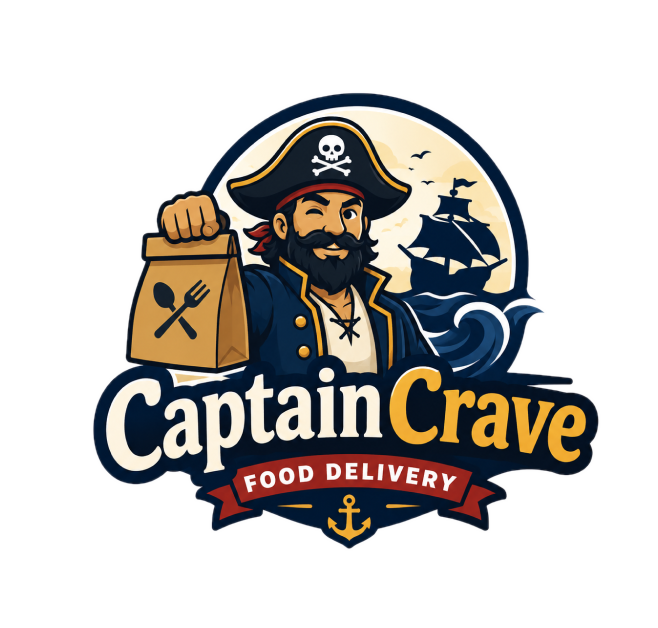

<p align="center">
  
</p>

<h1 align="center">CaptainCrave</h1>

<p align="center">A full-stack food ordering platform. Browse restaurants, explore menus, and place orders.</p>

<p align="center">
  
  
  
  
  
</p>

---

## Overview

CaptainCrave connects customers with local restaurants. Customers can browse nearby restaurants, view menus by category, and place orders. Restaurant owners can manage their listings, menus, and menu items through a protected API. The platform has an Angular frontend and an ASP.NET Core backend.

---

## Tech Stack

| Area | Technology |
|---|---|
| Frontend | Angular 22, TypeScript |
| Backend | ASP.NET Core 10, C# |
| Database | SQL Server, Entity Framework Core 10 |
| Real-time | SignalR |
| Auth | JWT Bearer, BCrypt |
| Orchestration | .NET Aspire |
| Testing | xUnit, Moq |

---

## Backend Architecture

The backend uses a layered architecture. Each layer has one job, and each layer only talks to the layer directly below it.

A request flows down through the layers, and the result flows back up through the same layers:

```
Request:   Controller -> Service -> Repository -> Database
Response:  Controller <- Service <- Repository <- Database
```

| Layer | Folder | Responsibility |
|---|---|---|
| Controllers | `Controllers/` | Receive HTTP requests, validate input, return responses |
| Services | `Services/` | Business logic |
| Repositories | `Repositories/` | Database queries via EF Core |
| Models | `Models/` | EF Core entities mapped to tables |
| DTOs | `DTOs/` | Data shapes at the API boundary |
| Mappers | `Mappers/` | Convert between models and DTOs |

Controllers never touch the database directly. Services never know about HTTP. Repositories never contain business rules.

For the full explanation of the architecture, the domain model, and the SignalR notification system, see [Backend/CaptainCrave.Api/README.md](Backend/CaptainCrave.Api/README.md#architecture).

### Local secrets for Backend

From the `Backend/CaptainCrave.Api` folder, set these user secrets before running the API:

```bash
dotnet user-secrets init
dotnet user-secrets set "Jwt:Secret" "replace-with-a-long-random-secret-at-least-32-characters"
dotnet user-secrets set "Jwt:Issuer" "CaptainCrave.Api"
dotnet user-secrets set "Jwt:Audience" "CaptainCrave.Client"
dotnet user-secrets set "ConnectionStrings:DefaultConnection" "Server=localhost;Database=CaptainCraveDb;Trusted_Connection=True;TrustServerCertificate=True"
```

`Jwt:Secret` must be at least 32 characters, since it is used to sign tokens with HMAC-SHA256. Adjust the connection string's `Server=` value to match your own SQL Server instance (for example `(localdb)\MSSQLLocalDB` if you use LocalDB instead of a full instance).

For full backend setup steps, see [Backend/CaptainCrave.Api/README.md](Backend/CaptainCrave.Api/README.md).

---

## Running with .NET Aspire

.NET Aspire starts the API and the Angular client together, with one command, and shows both in a single dashboard. This is the easiest way to run the whole project locally.

Install the Aspire CLI:

```bash
winget install Microsoft.Aspire
```

Make sure Docker Desktop is installed and running, since Aspire uses it for local resources.

Then, from `Backend/CaptainCrave.AppHost`, run:

```bash
aspire run
```

This opens the Aspire dashboard, where you can see both the API and the client, their logs, and the URL each one is running on.

You can also run the API and the client separately without Aspire. See [Backend/CaptainCrave.Api/README.md](Backend/CaptainCrave.Api/README.md#running-the-project) and [Client/README.md](Client/README.md) for standalone instructions.

---

## Tests

Unit tests live in `Backend/CaptainCrave.Tests` and cover the API controllers, plus one end-to-end test for the SignalR notification hub.

| Tool | Purpose |
|---|---|
| xUnit | Test framework |
| Moq | Mocks service dependencies, so tests run without a database or HTTP pipeline |

Each controller test class follows the same pattern: create a mock service, inject it into the controller, set up the mock to return a fixed value, call the controller method, and check the result type and body.

Run all tests:

```bash
dotnet test
```

For more detail, see [Backend/CaptainCrave.Tests/README.md](Backend/CaptainCrave.Tests/README.md).

---

## Documentation

| README | Contents |
|---|---|
| [README.md](README.md) | Project overview, architecture summary, test summary, local secrets |
| [Backend/CaptainCrave.Api/README.md](Backend/CaptainCrave.Api/README.md) | Backend architecture, authentication, SignalR, EF Core migrations, seed data, running the API |
| [Backend/CaptainCrave.Tests/README.md](Backend/CaptainCrave.Tests/README.md) | Test stack, folder structure, why `[Fact]`, running and filtering tests |
| [Client/README.md](Client/README.md) | Angular frontend setup, development server, build and test commands |

